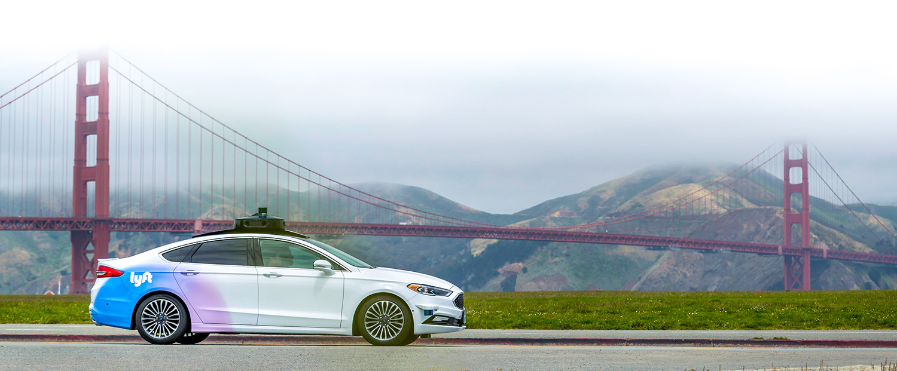

# Lyft_competition
Lyft Motion Prediction for Autonomous Vehicles: Kaggle kernels

This is a collection of kernels submitted to the Kaggle competition hosted by ridesharing company Lyft which started Level 5, self-driving division to tackle the challenges in the field of self-driving cars.

In this competition our task is to build motion prediction models for self-driving vehicles. Model which can predict the movement of traffic agents around the Autonomous Vehicles such as cars, cyclists, and pedestrians etc. We are required to predict how these different agents move in Autonomous Vehicles's environment.

## What we are predicting?

The competition is to predict the motion of external objects (agents) such as cars, cyclist, pedestrains etc in order to assist the self-driving car. 
The goal is to predict the location of objects agents in the next 50 frames.
The ouput is a csv submission file with coordinates and timestamps for each object
